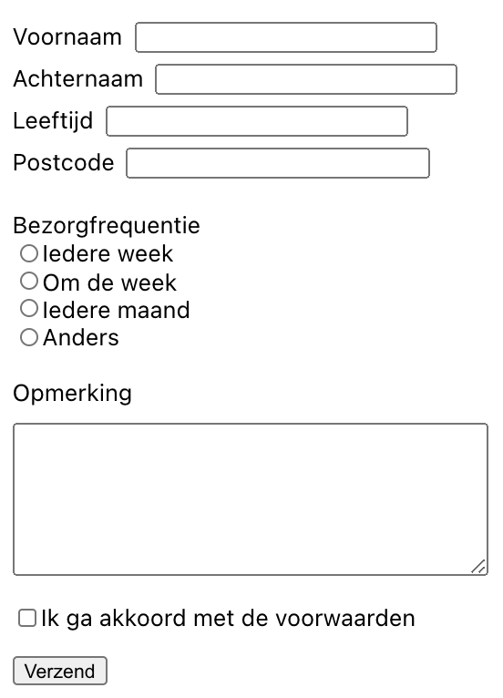

# Opdrachtbeschrijving

## Inleiding
Je vrienden Freek en Bernard zijn allebei doorgewinterde horeca-toppers, maar vanwege de wereldwijde pandemie zijn zij helaas hun baan kwijtgeraakt. Gelukkig zijn Freek en Bernard niet voor één gat te vangen, dus zijn ze samen een bedrijfje begonnen: 

Zelf vraag je je af of het slim was om Bernards 9-jarige nichtje het logo te laten ontwerpen, maar dat terzijde. Je bent allang blij dat ze iets te doen hebben. Daarom wil je ze natuurlijk een handje helpen door een online bestelformulier voor ze te maken!

## Applicatie starten
Als je het project gecloned hebt naar jouw locale machine, installeer je eerst de `node_modules` door het volgende commando in de terminal te runnen:

`npm install`

Wanneer dit klaar is, kun je de applicatie starten met behulp van:

`npm start`

of gebruik de WebStorm knop (npm start). Open http://localhost:3000 om de pagina in de browser te bekijken. Begin met het maken van wijzigingen in `src/App.js`: elke keer als je een bestand opslaat, zullen de wijzigingen te zien zijn op de webpagina.

## Opdracht 1 - State
Gebruikers gaan zelf aan de slag met het samenstellen van hun fruitmand. Ze hebben de keuze tussen vier typen fruit waarvan ze de aantallen mogen bepalen:

Zoals je ziet is de styling niet belangrijk, focus je in eerste instantie op de functionaliteit. Heb je tijd over? Kijk dan vooral bij de bonusopdrachten!

### Randvoorwaarden fruit-counters
* Je maakt gebruik van de useState hook van React om de hoeveelheden bij te houden
* Klanten hebben de vrijheid om te kiezen tussen vier typen fruit:
    1. Bananen 🍌
    2. Aarbeien 🍓
    3. Appels 🍏
    4. Kiwi's 🥝
* Elk type fruit heeft twee buttons: één die de hoeveelheid verhoogd (`+`) en één die de hoeveelheid verlaagd (`-`).
* De hoeveelheid geselecteerde fruittypes wordt bij iedere update getoond aan de gebruiker
* Er is ook een reset button, die alle counters weer op 0 zet.

## Opdracht 2 - React Hook Form
Het is natuurlijk lastig om een fruitmand te bestellen als we niet weten waar die mand naartoe moet. Daarom gaan we een bestelformulier maken met React Hook Form:

Zoals je ziet is de styling niet belangrijk, focus je in eerste instantie op de functionaliteit. Heb je tijd over? Kijk dan vooral bij de bonusopdrachten! 
Vergeet niet de [documentatie](https://react-hook-form.com/) van React Hook Form bij de hand te houden, hier staan enorm veel code voorbeelden die je kunnen helpen.

### Randvoorwaarden formulier
* Het formulier is gebouwd in React Hook Form
* Het formulier bevat de volgende velden:
    * Voornaam:
        * Verplicht
    * Achternaam:
        * Verplicht
    * Leeftijd:
        * Verplicht
        * Minimaal 18 jaar
    * Postcode:
        * Verplicht
    * Huisnummer zonder toevoeging:
        * Verplicht
    * Radiobuttons bezorgfrequentie:
        * Opties: iedere week, om de week, iedere maand, anders
        * Verplicht
    * Andere bezorgfrequentie
        * Verplicht bij optie anders
        * Wordt alleen getoond als optie anders is geselecteerd
    * Opmerking (textarea)
    * Akkoord met de voorwaarden (checkbox)
    * Verzendbutton
* Alle velden worden gevalideerd tijdens typen (default gedrag)
* Wanneer de gebruiker op verzenden drukt, worden de formulier-waardes in de console gelogd!

## Bonus opdrachten
* Maak componenten van elementen die je heel veel hebt hergebruikt, zoals bijvoorbeeld:
  * De reset- en verzenden button
  * De - counter + combinatie
  * De label- en text-input combinatie
  * Ga zo maar door!
* Maak er een mooie gestylde pagina van!
* En als je dan toch bezig bent, voorzie dan de buttons van conditionele styling. Wanneer een fruitsoort 1 of meer keer aangeklikt is, kun je 'm bijvoorbeeld een gekleurde rand geven!
* Zorg ervoor dat het postcode-veld valideert op een patroon - en dus checkt of de input wel het format van Cijfer Cijfer Cijfer Cijfer Letter Letter aanhoud. _Tip_: hier kun je RegEx voor gebruiken!    
